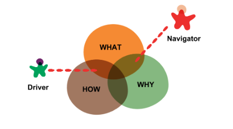
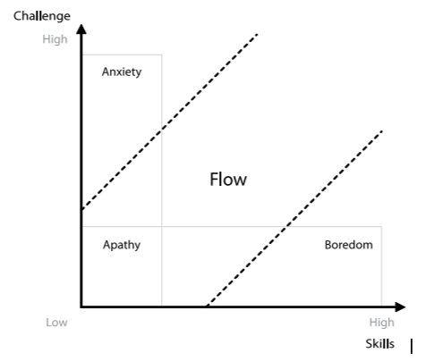

# Pairing Guidelines

### Goal
- Do not generate stress and enter in flow together.
### The pair should
- Help each other to keep focused in the current step.
- Brainstorm refinements to the system.
- Clarify ideas.
- Take the initiative when the other is stuck.
- Adopt each one of the roles.

## As a Driver
- Keep the focus on the current step
- Communication
  - Get in the habit of thinking out loud. Talk about what you're going to do, what you're doing and what you just did.
    - This makes sure both you and your pair are on the same page.
    - This helps the navigator keep the focus.
  - A good rule of thumb is that at any moment you should be able to stop typing and your pair should be able to take over.
- Be aware when the navigator get mad at you and talk about it.

## As a Navigator
- If the flow is interrupted continuously, pairing is frustrating.
  - The mission is to discover when the driver is ready to listen to me.
  - Waiting for the silence in order to start up a discussion is not enough.
    - Sometimes the drivers need some silence to think.
  - Mind the abstraction level of the interruptions.
    - Low level abstraction comments are easier to handle than high level ones.
- Keep the focus on the final goal.

## Split time (not pairing)
- Acknowledge when you’re not getting the benefits of pairing and split up. It’s common for mechanical or very trivial tasks that both pair members can accomplish by themselves. Unless there’s some learning/teaching involved there’s no use to work on something that doesn’t require taking any decisions or thinking about the task.
- Keep syncing up when you split. You still work on that story together.

## Modalities
- When the level of knowledge and practice is different. Know in which mode are you working.
  - **Capacitive**: In this mode we may trading productivity in favour of learning/knowledge transmission.
    - Driver should be the person receiving knowledge.
  - **Productive**: In this mode we may be trading learning/knowledge transmission in favour of productivity (getting things done). Note that this is also an opportunity for novices to see more experience fellows “in action”.
    - Driver should be the person with the most knowledge/practice to get things done.

## Common errors
- Starting a pairing session without a clear objective
- Monopolizing the keyboard while the other asks.
- Do not ask the keyboard when you feel it is necessary. (Almost worse than monopolize it)
- Do not let the pair express himself.
- The pair have to be equally comfortable both reading and writing.
- No rest (or swap) efficiently.

## Practice
- Pomodoro
  - Before starting
    - Define session goals and start with one of them
    - Create a TO-DO list or some kind of little roadmap to focus on the right level of abstraction. (Technical Tasks?)
    - Keep the focus and take the breaks
  - Pairs
    - Experiment rotating pairs to improve different aspects on the team and get feedback about it in the retrospectives.
    - Balance skill and challenge in order to achieve the flow.

## Conclusions
- The challenge lies in getting to know your pair enough to notice when you are pairing badly.

## Links

- http://juandavidvega.es/2015/11/08/pair-programming-mi-guia-practica/
- http://www.carlosble.com/2015/07/productive-pair-programming/
- http://www.carlosble.com/2015/12/pairing-dont-have-to-agree-on-the-plan/
- https://www.facebook.com/notes/kent-beck/pairing-as-pruning/912024212163777
- https://developer.atlassian.com/blog/2015/05/try-pair-programming/
- https://www.thoughtworks.com/insights/blog/effective-navigation-in-pair-programming
- http://www.wikihow.com/Pair-Program 

